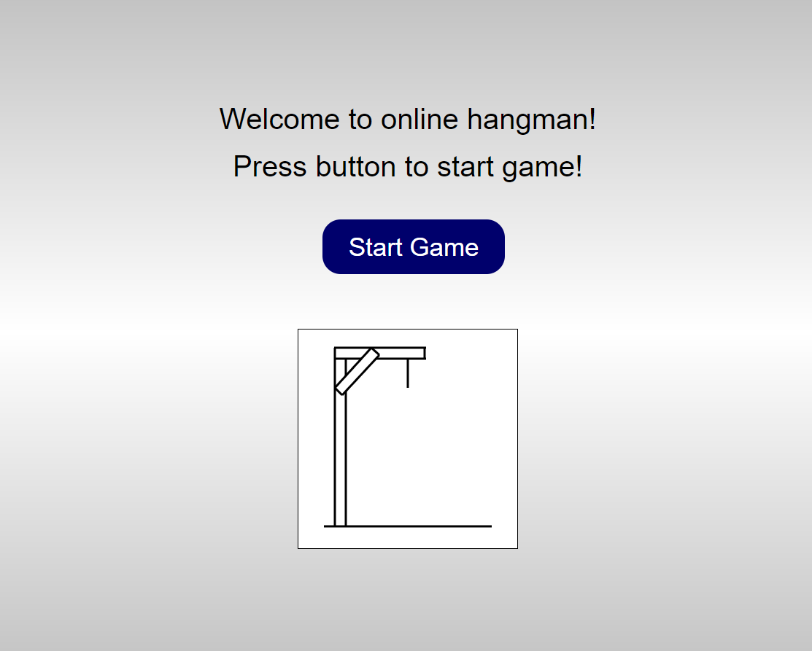
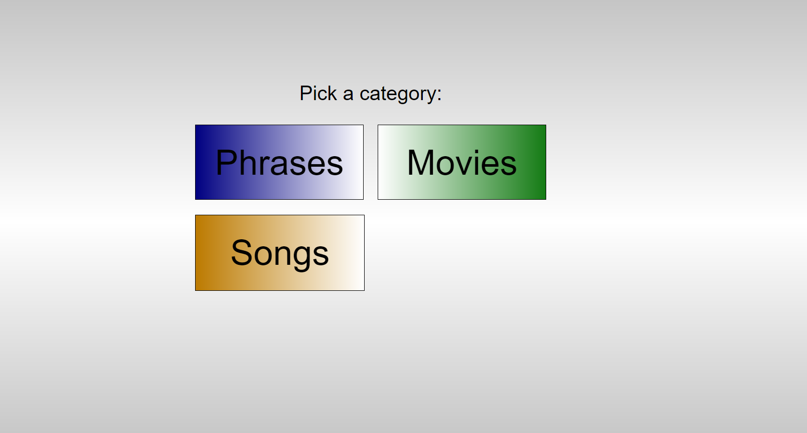
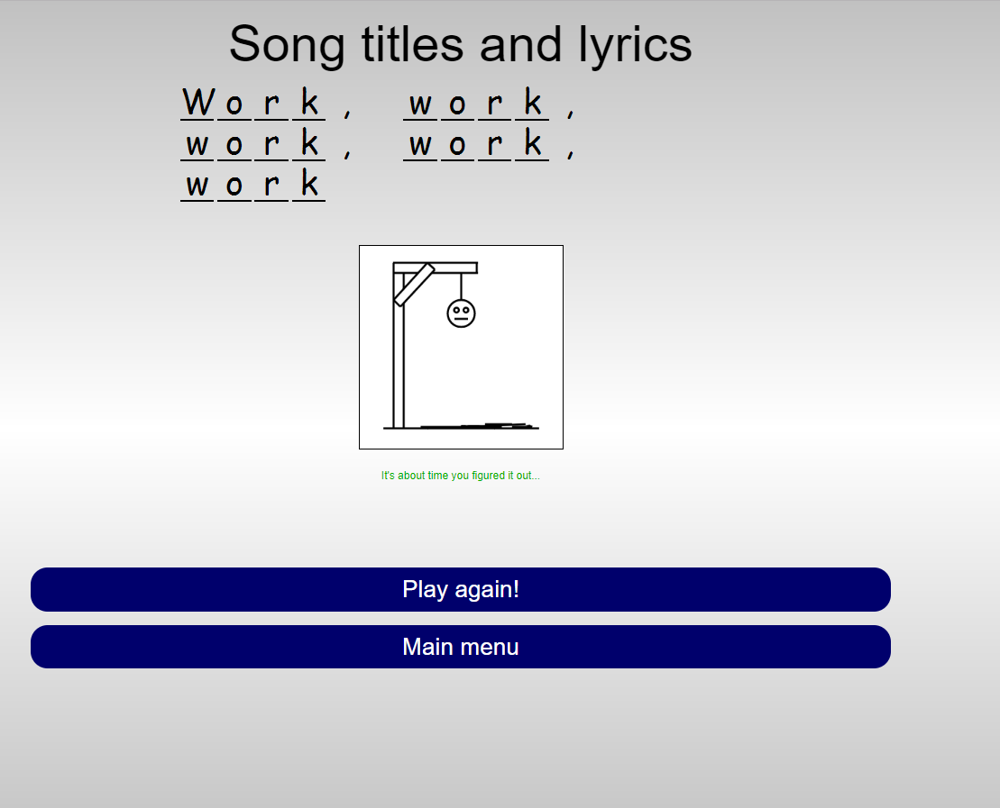

<h1 align="center">Hangman-Game</h1>

<h2>Game Starting Page<h2>

    

<h2>Game Selection Page<h2>

    

<h2>Game Page<h2>

    

<h3>Technologies used</h3>

<ul>
    <li><strong>HTML</strong></li>
    <li><strong>CSS - Bootstrap</strong></li>
    <li><strong>Javascript</strong></li>
</ul>

<h3>Check it out!</h3>

<ul>
    <li><strong>https://alrod909.github.io/Hangman-Game/</strong></li>
</ul>
